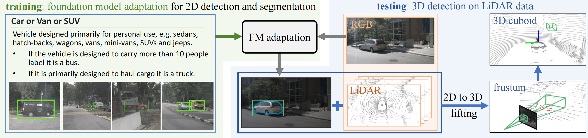

# Towards Auto-Annotation from Annotation Guidelines: A Benchmark through 3D LiDAR Detection

 <!-- Replace with your actual image path -->

## Overview
Data annotation is a critical but labor-intensive and costly step in machine learning pipelines, requiring human annotators to label data based on expert-crafted guidelines. To address this challenge, we introduce ​**AnnoGuide**, a benchmark for evaluating automated methods that generate annotations directly from guidelines—eliminating manual labeling.  

As a case study, we repurpose the ​**nuScenes** dataset (used in autonomous driving), leveraging its annotation guidelines for 3D LiDAR point cloud labeling (18 object classes). The task is novel: ​**multi-modal few-shot 3D detection without 3D annotations**, combining limited visual examples and textual descriptions.  

We propose a pipeline using ​**foundation models (FMs)** to:  
1. Detect and segment objects in RGB images,  
2. Project 2D detections into 3D using camera poses,  
3. Cluster LiDAR points within each frustum to generate 3D cuboids.  

Starting with off-the-shelf FMs (12.1 mAP), we refine components to achieve ​**21.9 mAP**, demonstrating progress while highlighting AnnoGuide’s open challenges. Our work underscores the need for advancing ​**LiDAR-based foundation models** to further automate annotation.  

## Installation
To set up the repository, follow these steps:
1. **Clone the Repository**
    ```bash
    git clone https://github.com/annoguide/annoguide3Dbenchmark.git
    ```
2. **Create the Environment**
   ```bash
    conda create -n annoguide python=3.8
    conda activate annoguide
    ```
3. ​**Install MMDetection**
    ```bash
    conda install pytorch torchvision -c pytorch
    pip install -U openmim
    mim install mmengine
    mim install "mmcv>=2.0.0"
    cd mmdetection
    pip install -v -e .
    ```
4. **Install SAM**
    ```bash
    pip install segment_anything
    ```
5. ​**Install Nuscenes-LT3d**
    ```bash
    git clone https://github.com/neeharperi/nuscenes-lt3d.git
    cd nuscenes-lt3d/setup
    python setup.py install 
    ```
## Data Preparation
1. **NuScenes Dataset**

    Download from [NuScenes](https://www.nuscenes.org/nuscenes)

2. **Few-shot Data from Guidelines**

    Download through [GoogleDrive](https://drive.google.com/file/d/1H0igDf6j0DPHh5YDMKfJ3ZpDbpD8UagC/view?usp=sharing)


3. **Small Validation Set for Prompt/Model Selection**

    Download through [GoogleDrive](https://drive.google.com/file/d/1vHd6W0moZmf0gqQgV-_fHameyGNfqngP/view?usp=sharing)

## Models
1. **GroundingDINO**

    Download through MMDetection: [MMDetection Repository](https://github.com/open-mmlab/mmdetection)

2. **Segment Anything Model (SAM)** 

    Download through official repository: [SAM Repository](https://github.com/facebookresearch/segment-anything)

## Pipeline Execution
### 2D Annotation Generation
1. **​Generate COCO-format 2D Labels**

    For training set
     ```bash
    python mmdetection/tools/GD/make_2D_labels.py --info_path data/nuscenes/nuscenes_infos_train.pkl --output_dir_path data/nuscenes/samples/labels_2D_COCO/CAM_ALL_train
    ```
    For validation  set
     ```bash
    python mmdetection/tools/GD/make_2D_labels.py --info_path data/nuscenes/nuscenes_infos_val.pkl --output_dir_path data/nuscenes/samples/labels_2D_COCO/CAM_ALL_val
    ```
2. **Generate Few-shot Annotation** 

     ```bash
    python mmdetection/tools/GD/make_2D_annos_few_shot.py
    python mmdetection/tools/GD/make_few-shot_file_name.py
    ```
3. **Generate Small Validation Set Annotation** 

     ```bash
    python mmdetection/tools/GD/make_2D_annos_val.py
    ```
4. **Train GroundingDINO with Optimized Prompts**

     ```bash
    python tools/train.py mmdetection/configs/mm_grounding_dino/grounding_dino_swin-l_finetune_8xb4_20e_nuscenes_train.py
    ```
5. **Evaluate GroundingDINO**

     ```bash
    python tools/test.py mmdetection/configs/mm_grounding_dino/grounding_dino_swin-l_finetune_8xb4_20e_nuscenes_test.py outputs/nuscenes/weights/epoch_6.pth
    ```
6. **Evaluate Offline Results**

     ```bash
    python mmdetection/mmdet/evaluation/metrics/coco_metric.py
    ```

### 3D Annotation Generation
1. **Generate 2D Masks with SAM** 

     ```bash
    python src/gen_mask.py
    ```
2. **Generate 3D Detections from 2D Masks** 

     ```bash
    python src/maks_to_3D_results.py
    ```
3. **Generate 3D Detections from 2D Masks** 

     ```bash
    python src/maks_to_3D_results.py
    ```
4. **Post-processing (Attributes & Confidence Sorting)** 

     ```bash
    python src/post_process/json2pkl.py
    ```
5. **Confidence Smoothing via 3D Tracking** 

     ```bash
    python src/post_process/average_score_by_tracking.py
    ```
6. **3D Evaluation Metrics** 

     ```bash
    python src/eval/eval_3D_results.py
    ```    
## Results
1. **2D Detection Results**

    Download through [GoogleDrive](https://drive.google.com/file/d/1p39B3_ZCE5OKRYLZKMifvinYY0kzvqmo/view?usp=sharing)

2. **3D Detection Results** 

    Download through [GoogleDrive](https://drive.google.com/file/d/1aVtFWD6F73CD_dsM3nW2IAVSCKfsAaSz/view?usp=drive_link)
